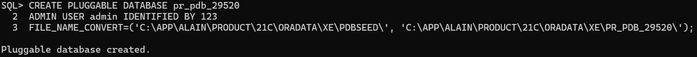
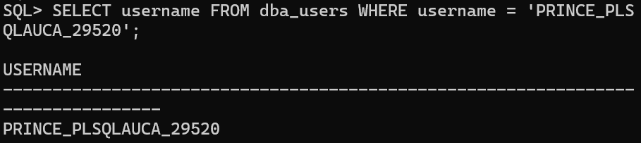
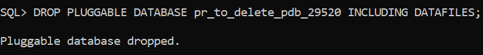
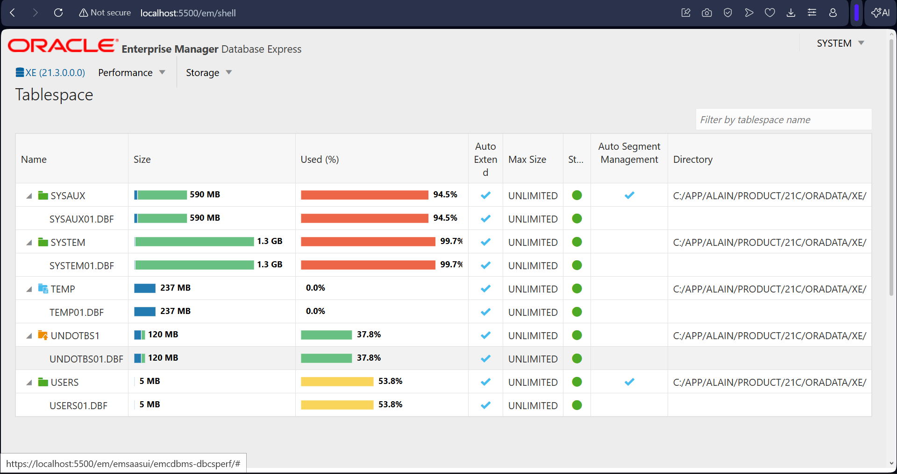

# Oracle PDB Management Assignment
**Student Name:** Alain Yves Prince Ikuzwe 
**Student ID:** 29520

## Task 1: Permanent PDB & User Creation
I created the permanent PDB `pr_pdb_29520` and the local user `PRINCE_PLSQLAUCA_29520`.

**Proof of PDB Status:**

**Proof of User Creation:**

---

## Task 2: PDB Lifecycle Management
To demonstrate management, I created a temporary PDB and then dropped it including all datafiles.

**Proof of PDB Dropping:**

---

## Task 3: OEM Configuration
The Oracle Enterprise Manager was configured. Below is the storage view showing the datafiles located in the `C:/APP/ALAIN/` directory.

**OEM Storage View:**

---

## 4. Challenges Faced & Solutions
During this assignment, I encountered and resolved the following technical issues:

* **Authentication Errors (ORA-01017):** Initially failed to log in as a super-admin. Resolved by using the specific syntax `sys as sysdba` to gain administrative privileges.
* **Restricted Queries (ORA-01219):** Encountered an error where the database was "mounted" but not "open." Resolved this by executing `ALTER PLUGGABLE DATABASE OPEN` to allow user queries.
* **PDB File Management (ORA-65016):** Faced issues during PDB creation regarding file locations. Resolved by using the `FILE_NAME_CONVERT` parameter to correctly map the seed files to the new directory.
* **OEM Visualization:** Noticed that the OEM graphical interface was not displaying active sessions. Verified the configuration by drilling down into the **Tablespace Storage** view to confirm physical file locations.

---

## Integrity Statement
I confirm that this is my individual work.
